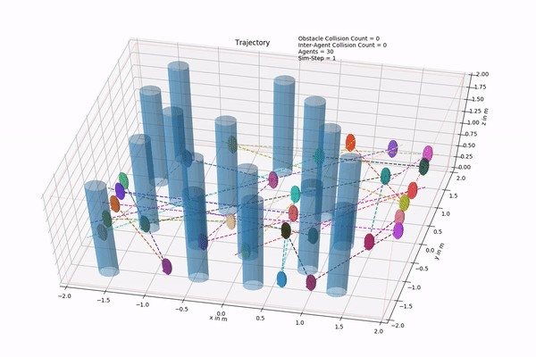

# AMSwarm Repository Code

### Installation
This work is implemented in C++17 and tested on ROS Melodic.  
* Install [ROS](http://wiki.ros.org/ROS/Installation)
* Install [eigen_quad_prog](https://github.com/jrl-umi3218/eigen-quadprog) and run ```sudo ln -s /usr/include/eigen3/Eigen /usr/include/Eigen```.

* Clone and build the package as follows:  
``` 
cd your_ws/src
git clone https://github.com/vivek-uka/AMSwarm
cd .. 
catkin_make  
source devel/setup.bash  
``` 

### Demos
| Approach | Params File | Command |
| -------- | -------- |-----|
|Ours (Quadratic)|  ```config_am_swarm.yaml``` set ```axis_wise``` to ```false``` | ``` rosrun amswarm swarm_am_nav```|
|Ours (Axiswise)|  ```config_am_swarm.yaml``` set ```axis_wise``` to ```true```| ``` rosrun amswarm swarm_am_nav```|
|SCP (Continuous)|  ```config_scp_swarm.yaml``` set ```on-demand``` to ```false```| ``` rosrun amswarm swarm_scp_nav```|
|SCP (Ondemand)|  ```config_scp_swarm.yaml``` set ```on-demand``` to ```true```| ``` rosrun amswarm swarm_scp_nav```|
|ACADO | ```config_acado_swarm.yaml```|``` rosrun amswarm swarm_acado_nav_"num_drone" ``` num_drone = {2, 4, 6, 8}|

After running any of the approach, it should display success or faliure. To visulaize the simulated data run ```python animate_sim_data.py``` in the ```data``` folder for approches except for ACADO. For ACADO, run ```python animate_acado.py```. Run any approach with the current configuration and visualize using the corresponding python file.

### Changing Configuration

Change various parameters in ```some_file_name.yaml``` files of folder ```params```. You can find description of each paramter in the ```some_name_help.txt```.


### Example Scenario

Ours in action:  


### Notes
* Clean and fix issues in ```world``` to ```2```.